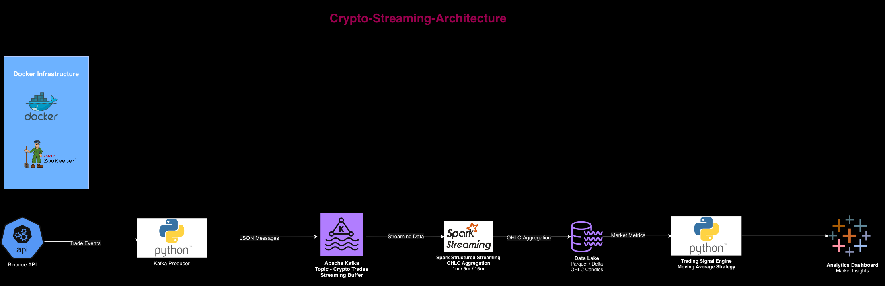

# Real-Time Crypto Market Data Streaming Pipeline

A real-time data engineering pipeline that ingests cryptocurrency trade events, processes them using Apache Kafka and Spark Structured Streaming, and generates market analytics and trading signals.

This project demonstrates how to build a **production-style event-driven streaming pipeline** used in modern financial data systems.

---

## Architecture



Pipeline flow:

Binance API → Kafka Producer → Apache Kafka → Spark Structured Streaming → Data Lake → Trading Signal Engine → Analytics Dashboard

---

## Key Features

- Real-time crypto trade ingestion from Binance API
- Event streaming using Apache Kafka
- Stream processing using Spark Structured Streaming
- OHLC candle aggregation (1m / 5m / 15m)
- Data lake storage using Parquet
- Trading signal generation using moving average strategy
- Analytics visualization using Tableau

---

## Tech Stack

| Layer | Technology |
|------|------------|
| Language | Python |
| Streaming | Apache Kafka |
| Processing | Apache Spark Structured Streaming |
| Storage | Parquet Data Lake |
| Infrastructure | Docker |
| Visualization | Tableau |

---

## Project Structure

```
hft-crypto-data-pipeline
│
├── producer/
│   └── binance_producer.py
│
├── streaming/
│   └── spark_ohlc.py
│
├── signals/
│   └── generate_signals.py
│
├── service/
│   └── read_parquet.py
│
├── config/
│   └── settings.py
│
├── schemas/
│   └── trade_event.py
│
├── docker/
│   └── docker-compose.yml
│
├── data/
│
├── architecture.png
├── requirements.txt
└── README.md
```

---

## Data Pipeline Flow

### 1. Data Ingestion
The Binance API provides real-time cryptocurrency trade events.  
A Python Kafka producer fetches trade data and publishes it to a Kafka topic.

### 2. Event Streaming
Apache Kafka acts as the streaming backbone that buffers and distributes trade events to downstream consumers.

Kafka Topic: **crypto-trades**

### 3. Stream Processing
Spark Structured Streaming consumes Kafka events and performs real-time aggregation to generate OHLC candle data.

Supported windows:
- 1 minute
- 5 minute
- 15 minute

### 4. Data Lake Storage
Aggregated market data is stored in a Parquet-based data lake.

### 5. Trading Signal Engine
A Python-based signal engine reads OHLC candle data and computes trading signals using a moving average strategy.

Signals generated:
- BUY
- SELL
- HOLD

### 6. Analytics Dashboard
Processed market metrics can be visualized in analytics tools such as Tableau.

---

## Running the Project

### 1. Clone Repository

```bash
git clone https://github.com/YOUR_USERNAME/hft-crypto-data-pipeline.git
cd hft-crypto-data-pipeline
```

### 2. Create Virtual Environment

```bash
python3 -m venv venv
source venv/bin/activate
```

### 3. Install Dependencies

```bash
pip install -r requirements.txt
```

### 4. Start Kafka Infrastructure

```bash
cd docker
docker compose up -d
cd ..
```

### 5. Start Spark Streaming Job

```bash
export PYTHONPATH=$(pwd)

spark-submit \
--packages org.apache.spark:spark-sql-kafka-0-10_2.12:3.5.1 \
streaming/spark_ohlc.py
```

### 6. Start Kafka Producer

Open a new terminal and run:

```bash
python producer/binance_producer.py
```

### 7. Generate Trading Signals

```bash
python signals/generate_signals.py
```

---

## Example Pipeline Output

Example OHLC candle data:

| Timestamp | Open | High | Low | Close |
|-----------|------|------|------|------|
| 10:01 | 42850 | 42890 | 42820 | 42860 |

Example trading signal:

```
Trading Signal: BUY
```

---

## Future Improvements

Possible enhancements to this pipeline:

- Delta Lake instead of Parquet
- Kafka Schema Registry
- Real-time dashboards with Grafana
- Feature store for ML models
- Deployment using Kubernetes

---

## Why This Project Matters

This project demonstrates core data engineering concepts used in modern real-time analytics systems:

- event-driven architecture
- streaming data processing
- scalable data pipelines
- financial market data analytics

---

## Author

Aditya Bagdi  
Senior Data Engineer